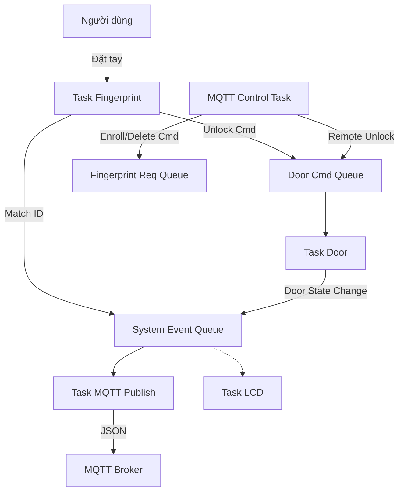

# IoT Smart Door & Attendance System Firmware 🔒🖐️

[](https://platformio.org/)
[](https://www.arduino.cc/)
[](https://www.freertos.org/)

Firmware cho hệ thống kiểm soát ra vào và chấm công thông minh sử dụng **ESP32**, cảm biến vân tay **AS608**, và giao thức **MQTT**. Hệ thống được thiết kế theo kiến trúc **Event-Driven** trên nền tảng **FreeRTOS** để đảm bảo tính ổn định và phản hồi thời gian thực.

## 🚀 Tính năng nổi bật

*   **Xác thực vân tay (AS608):** Quét, thêm mới (Enroll), xóa (Delete) và kiểm tra danh sách vân tay.
*   **Điều khiển cửa tự động:**
    *   Mở khóa bằng vân tay hợp lệ.
    *   Tự động khóa lại sau một khoảng thời gian (Auto-lock).
    *   Cảm biến trạng thái cửa (Door Sensor) phát hiện cửa đang mở hay đóng.
*   **Điều khiển từ xa qua MQTT:** Nhận lệnh mở cửa, quản lý vân tay từ Server/App.
*   **Hệ thống hiển thị:** LCD 16x2 thông báo trạng thái hệ thống, hướng dẫn người dùng.
*   **Đồng bộ thời gian:** Tự động lấy giờ qua NTP Server.
*   **Kiến trúc đa nhiệm (Multitasking):** Sử dụng FreeRTOS với cơ chế **Queues** và **Semaphores** để quản lý luồng dữ liệu.

## 🛠️ Phần cứng (Hardware)

*   **MCU:** ESP32 Development Board.
*   **Cảm biến vân tay:** AS608 (Optical Fingerprint Sensor).
*   **Hiển thị:** LCD 1602 + Module I2C.
*   **Cơ cấu chấp hành:** Servo Motor (MG996R/SG90) hoặc Relay khóa chốt.
*   **Cảm biến cửa:** Reed Switch (Công tắc từ) hoặc Công tắc hành trình.

### Sơ đồ đấu nối (Pinout)

Cấu hình trong `app_config.h`:

| Thiết bị | Chân ESP32 | Ghi chú |
| :--- | :--- | :--- |
| **AS608 TX** | GPIO 16 (RX2) | UART2 RX |
| **AS608 RX** | GPIO 17 (TX2) | UART2 TX |
| **Servo** | GPIO 5 | PWM Output |
| **Door Sensor**| GPIO 15 | Input Pull-up (Nối đất khi đóng) |
| **LCD SDA** | GPIO 21 | Mặc định I2C ESP32 |
| **LCD SCL** | GPIO 22 | Mặc định I2C ESP32 |

---

## 🧠 Kiến trúc phần mềm (Software Architecture)

Hệ thống áp dụng mô hình **Producer - Consumer** thông qua **FreeRTOS Queues** để tách biệt các tác vụ xử lý phần cứng và logic nghiệp vụ.

### Các Task chính (System Tasks)

1.  **TaskFingerprint (Core 1):**
    *   Xử lý giao tiếp UART với cảm biến AS608.
    *   Thực hiện quét vân tay liên tục hoặc Enroll/Delete theo yêu cầu.
    *   Gửi sự kiện (Match/No Match) vào `system_evt_queue`.
2.  **TaskDoor (Core 1):**
    *   Quản lý State Machine của cửa (LOCKED, UNLOCKED, OPEN).
    *   Lắng nghe cảm biến cửa (Interrupt driven) và lệnh điều khiển từ Queue.
    *   Tự động đóng cửa sau timeout.
3.  **TaskLCD (Core 1):**
    *   Nhận thông điệp hiển thị từ `lcd_queue`.
    *   Quản lý việc hiển thị tạm thời (ví dụ: "Success") và tự động quay về màn hình chờ.
4.  **TaskMQTTClientLoop (Core 1):**
    *   Duy trì kết nối với MQTT Broker (`client.loop()`).
    *   Gửi Heartbeat định kỳ.
5.  **TaskMqttPublish (Core 1):**
    *   Consumer của `system_evt_queue`.
    *   Đóng gói dữ liệu thành JSON và Publish lên MQTT Broker.
6.  **MqttControlTask (Core 1):**
    *   Xử lý các gói tin JSON nhận được từ MQTT (`command` topic).
    *   Phân phối lệnh xuống `door_cmd_queue` hoặc `fp_request_queue`.

### Luồng dữ liệu (Data Flow)



---

## 📡 MQTT API Documentation

**Topic Base:** `esp32/vmh-test/esp32-client-{MAC_ADDRESS}`

### 1. Commands (Gửi xuống thiết bị)
Topic: `.../command`

| Lệnh | Payload (JSON) | Mô tả |
| :--- | :--- | :--- |
| **Mở cửa** | `{"cmd": "door_unlock"}` | Mở khóa cửa từ xa |
| **Thêm vân tay**| `{"cmd": "fp_enroll", "id": 10}` | Bắt đầu quy trình thêm vân tay ID 10 |
| **Xóa vân tay** | `{"cmd": "fp_delete", "id": 10}` | Xóa vân tay ID 10 |
| **Xem danh sách**| `{"cmd": "fp_show_all"}` | Yêu cầu thiết bị báo cáo số lượng ID |
| **Lấy trạng thái**| `{"cmd": "device_get_status"}` | Yêu cầu thiết bị gửi heartbeat |

### 2. Events (Thiết bị gửi lên)

Topic: `.../status`, `.../fingerprint`, `.../door`

**Ví dụ Payload:**
```json
{
  "device": "esp32-client-A1B2C3D4E5F6",
  "ts": "2025-12-25T14:30:00Z",
  "event": "fp_match",
  "finger_id": 1
}
```

*   `event`: `fp_match`, `fp_unknown`, `fp_enroll_success`, `door_state`, `device_status`, ...

---

## ⚙️ Cài đặt & Sử dụng (Setup)

### Yêu cầu
*   VS Code
*   Extension **PlatformIO IDE**

### Các bước thực hiện
1.  **Clone repo:**
    ```bash
    git clone https://github.com/vmh714/Iot_project_firmware.git
    ```
2.  **Cấu hình:**
    *   Mở file `src/app_config.h` (hoặc `include/app_config.h` tùy cấu trúc).
    *   Cập nhật thông tin WiFi:
        ```cpp
        #define WIFI_SSID "Your_WiFi_Name"
        #define WIFI_PASS "Your_WiFi_Pass"
        ```
    *   Cập nhật MQTT Broker nếu cần.
3.  **Build & Upload:**
    *   Kết nối ESP32 với máy tính.
    *   Nhấn biểu tượng **PlatformIO** -> **Project Tasks** -> **Upload**.
4.  **Monitor:**
    *   Mở Serial Monitor (Baudrate 115200) để xem log debug.

---

## 🤝 Đóng góp (Contributing)

Mọi đóng góp đều được hoan nghênh! Vui lòng tạo **Issue** hoặc gửi **Pull Request** nếu bạn tìm thấy lỗi hoặc muốn cải thiện tính năng.
